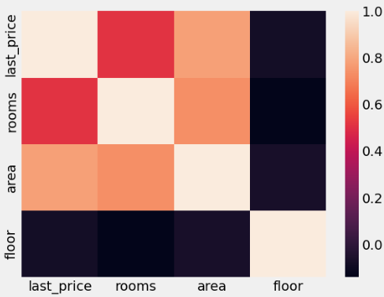
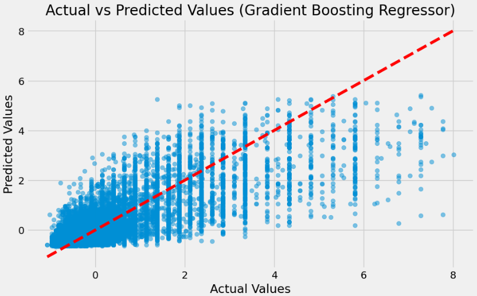

# Predicting Real Estate Data in St. Petersburg

We have data from [Yandex.Realty](https://realty.yandex.ru) containing real estate listings for apartments in St. Petersburg and Leningrad Oblast from 2016 till the middle of August 2018. In this lab, you'll learn how to apply machine learning algorithms to solve business problems. Accurate price prediction can help identify fraudsters automatically and assist Yandex.Realty users in making better decisions when buying and selling real estate.

## Data Overview

The dataset for model includes the following features:
- `first_day_exposition`
- `last_day_exposition`
- `last_price`
- `open_plan`
- `rooms`
- `area`
- `renovation`
- `last_price_log`

Example data:

| first_day_exposition       | last_day_exposition        | last_price | open_plan | rooms | area | renovation | last_price_log |
|----------------------------|----------------------------|------------|-----------|-------|------|------------|----------------|
| 2015-01-24T00:00:00+03:00 | 2016-01-19T00:00:00+03:00  | 20000.0    | 1         | 2     | 48   | 1          | 9.903488       |
| 2015-11-17T00:00:00+03:00 | 2016-03-04T00:00:00+03:00  | 24000.0    | 2         | 5     | 59   | 1          | 10.085809      |
| 2015-11-17T00:00:00+03:00 | 2016-04-24T00:00:00+03:00  | 18000.0    | 1         | 3     | 36   | 1          | 9.798127       |
| 2016-02-04T00:00:00+03:00 | 2016-02-28T00:00:00+03:00  | 18000.0    | 1         | 3     | 39   | 0          | 9.798127       |
| 2016-02-28T00:00:00+03:00 | 2016-04-02T00:00:00+03:00  | 19000.0    | 1         | 3     | 36   | 1          | 9.852194       |

Correlation matrix 




## Model Implementation

We used the `GradientBoostingRegressor` from `sklearn.ensemble` to predict real estate prices. Below is the code snippet for the model:

```python
from sklearn.ensemble import GradientBoostingRegressor
from sklearn import metrics
import numpy as np
import matplotlib.pyplot as plt

# Initialize the Gradient Boosting Regressor with given hyperparameters
gb_model = GradientBoostingRegressor(random_state=42, n_estimators=100, max_depth=3, 
                                     min_samples_split=2, min_samples_leaf=1)

# Fit the model on the training data
gb_model.fit(x_train, y_train)

# Predict on the validation data
gb_predictions = gb_model.predict(x_val)

# Calculate and print evaluation metrics
gb_mae = metrics.mean_absolute_error(y_val, gb_predictions)
gb_mse = metrics.mean_squared_error(y_val, gb_predictions)
gb_rmse = np.sqrt(gb_mse)
gb_r2 = metrics.r2_score(y_val, gb_predictions)

print('Mean Absolute Error (MAE):', gb_mae)
print('Mean Squared Error (MSE):', gb_mse)
print('Root Mean Squared Error (RMSE):', gb_rmse)
print('R² Score:', gb_r2)

# Scatter plot to compare predicted and actual values
plt.figure(figsize=(10, 6))
plt.scatter(y_val, gb_predictions, alpha=0.5)
plt.plot([min(y_val), max(y_val)], [min(y_val), max(y_val)], color='red', linestyle='--')
plt.title('Actual vs Predicted Values (Gradient Boosting Regressor)')
plt.xlabel('Actual Values')
plt.ylabel('Predicted Values')
plt.show()

```
## Model Performance

    Mean Absolute Error (MAE): 0.36180549868331346
    Mean Squared Error (MSE): 0.3518896387436877
    Root Mean Squared Error (RMSE): 0.5932028647466967



## How to Run the App with Virtual Environment

Set up virtual environment and activate it:

```bash
python3 -m venv env
source venv/bin/activate
pip install -r requirements.txt
python3 app.py


